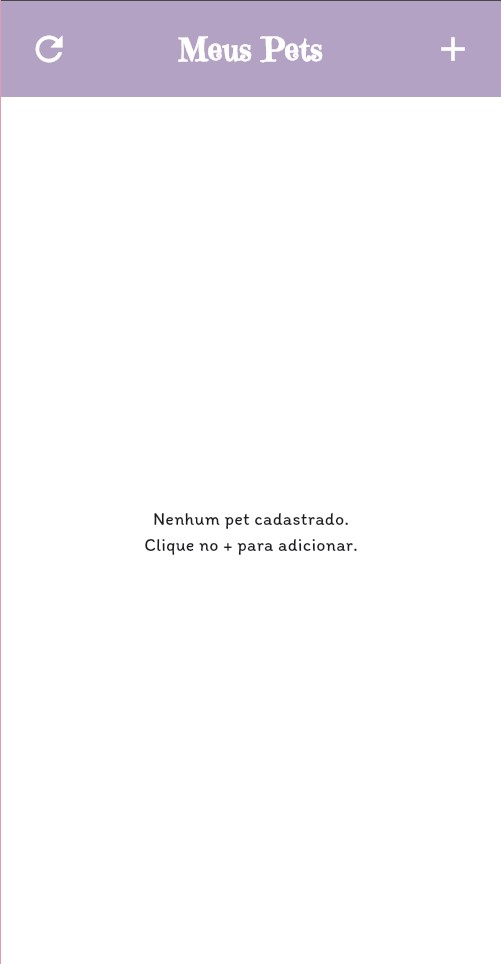
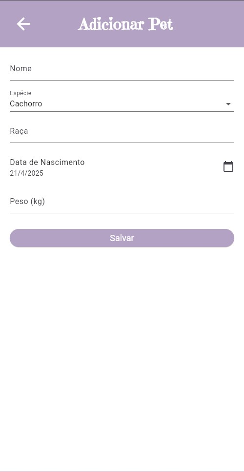
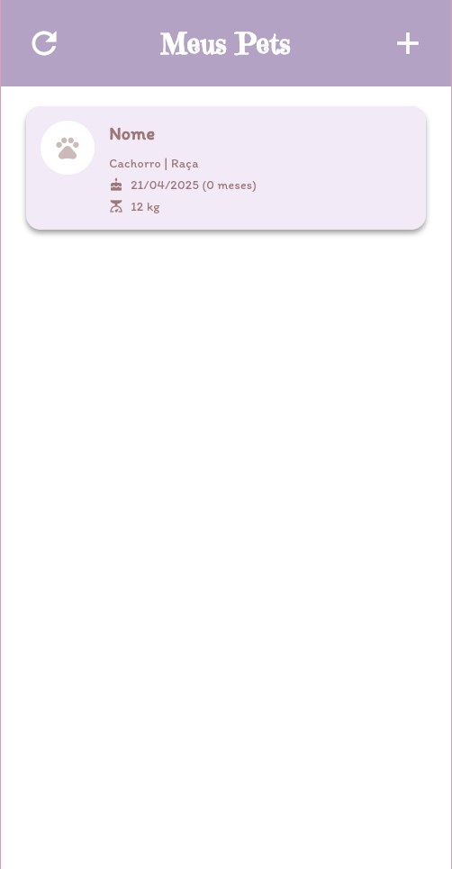
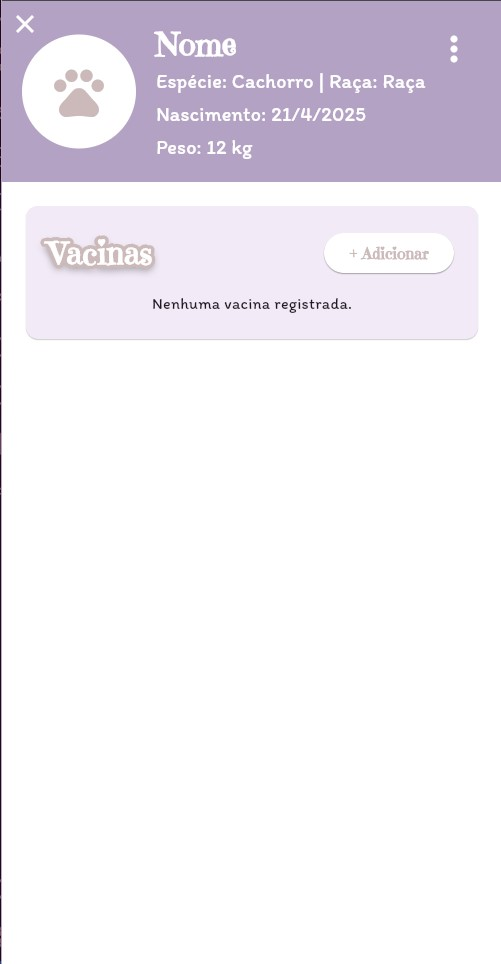
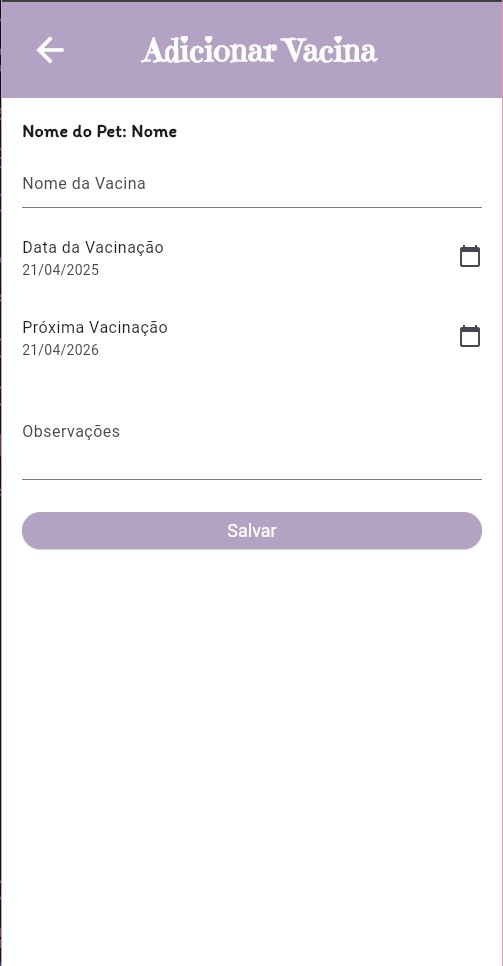
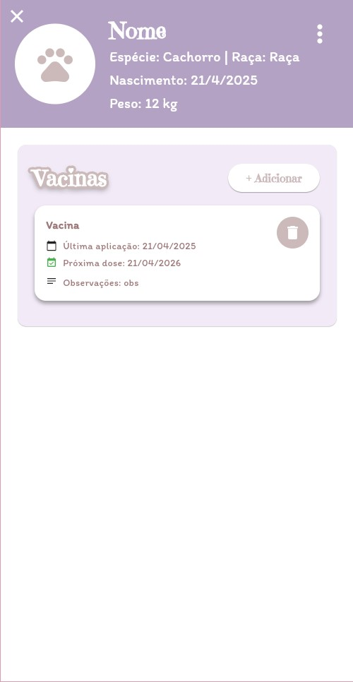
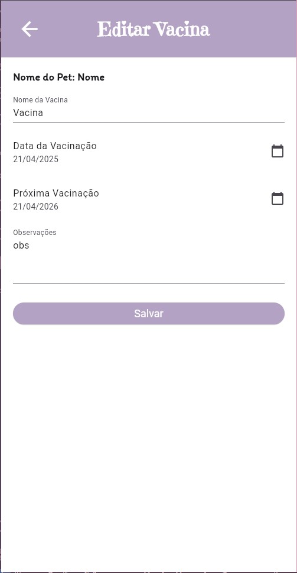
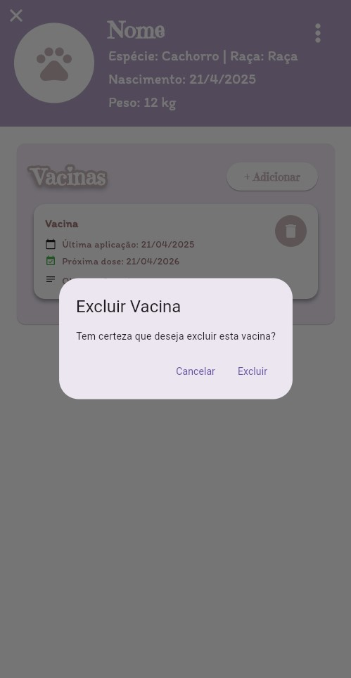
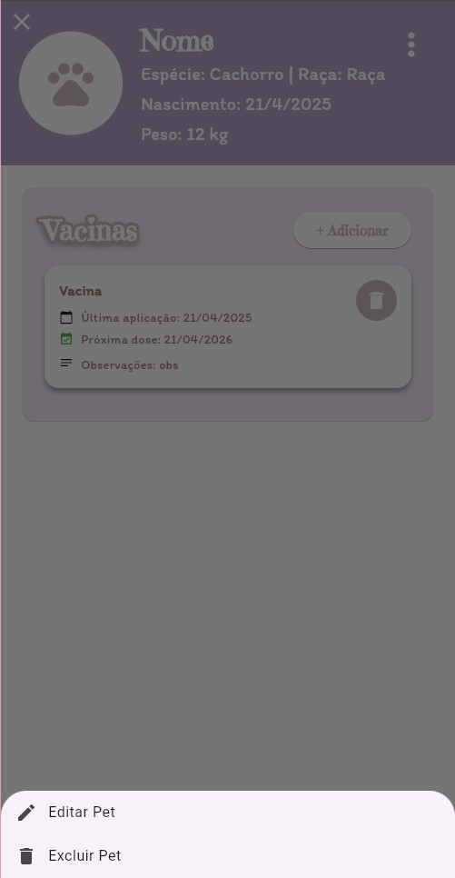
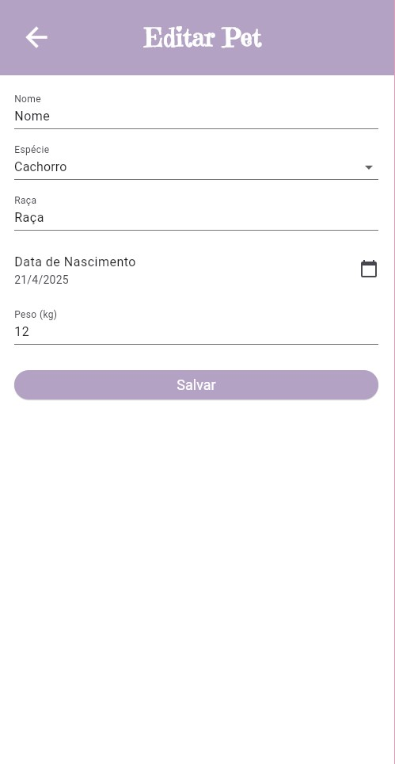

# Monitoramento de Pets 🐾

Este é um aplicativo Flutter para monitoramento de pets, permitindo que os usuários gerenciem informações sobre seus animais de estimação, incluindo vacinas, peso, e outras informações importantes.

## Funcionalidades

- **Cadastro de Pets**: Adicione informações como nome, espécie, raça, data de nascimento e peso.
- **Gerenciamento de Vacinas**: Registre e visualize as vacinas aplicadas em cada pet.
- **Edição e Exclusão**: Edite ou exclua informações de pets e vacinas.
- **Notificações para as vacinas agendadas**: Receba notificações quando a vacina de seu pet estiver próximo da data agendada.


## Instalação
1. Certifique-se de ter o [Flutter](https://docs.flutter.dev/get-started/install) instalado. 
2. Clone este repositório:
   ```bash
   git clone https://github.com/mayumihb/monitoramento_pets
   ```
3. Navegue até o diretório do projeto:
   ```bash
   cd monitoramento_pets
   ```
4. Instale as dependências:
   ```bash
   flutter pub get
   ```
5. Execute o aplicativo:
   ```bash
   flutter run
    ```

## Dependências
As principais dependências utilizadas neste projeto incluem:
 - Flutter
 - Google Fonts
 - Firebase

## Instruções de Uso
<h3>Tela Inicial<h3>

<h5><em>Clique no botão superior direito (+) para fazer um novo cadastro de animal de estimação</em></h5>
<br>

<h3>Cadastro de Pet<h3>

<h5><em>Preencha com as informações de seu pet e clique em 'Salvar'</em></h5>
<br>
  
<h3>Tela Inicial com Pet Cadastrado<h3>

<h5><em>Clique no card do pet para visualizar suas informações e vacinas</em></h5>
<br>
  
<h3>Informações do Pet<h3>

<h5><em>Clique no botão de adicionar para fazer um novo cadastro de vacina</em></h5>
<br>
  
<h3>Cadastro de Vacina<h3>

<h5><em>Preencha com as informações necessárias e clique em 'Salvar'</em></h5>
<br>
  
<h3>Informações do Pet com Vacina<h3>

<h5><em>Clique em qualquer lugar do card da vacina para editá-la</em></h5>
<br>
  
<h3>Editar Vacina<h3>

<h5><em>Preencha com as informações necessárias e clique em 'Salvar'</em></h5>
<br>
  
<h3>Excluir Vacina<h3>

<h5><em>Clique no botão de lixeira ao lado da vacina para excluí-la</em></h5>
<br>
  
<h3>Botão de Menu<h3>

<h5><em>Clique no botão de menu no canto superior direito para excluir ou editar um animal de estimação</em></h5>
<br>
  
<h3>Editar Pet<h3>

<h5><em>Preencha com as informações necessárias e clique em 'Salvar'</em></h5>
<br>

---
Desenvolvido por Mayumi Hirata Bogoni - 2025
